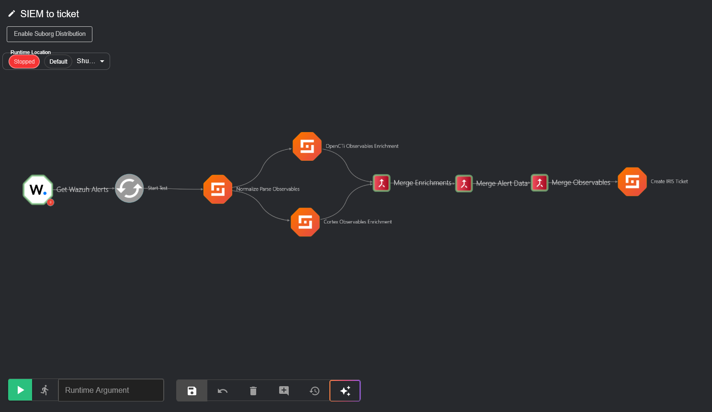
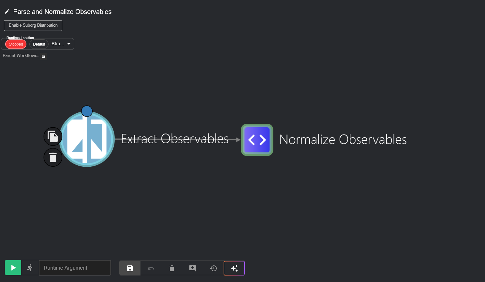
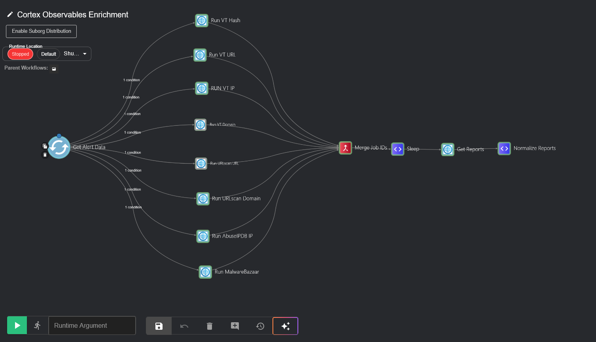
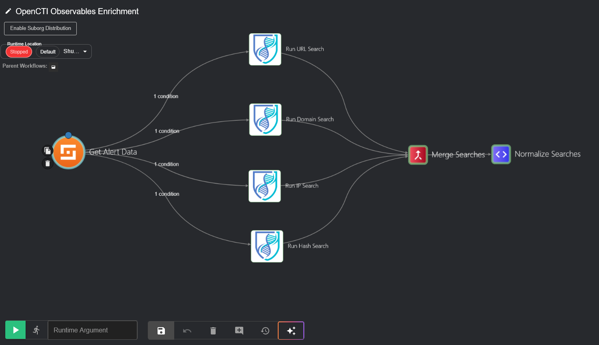
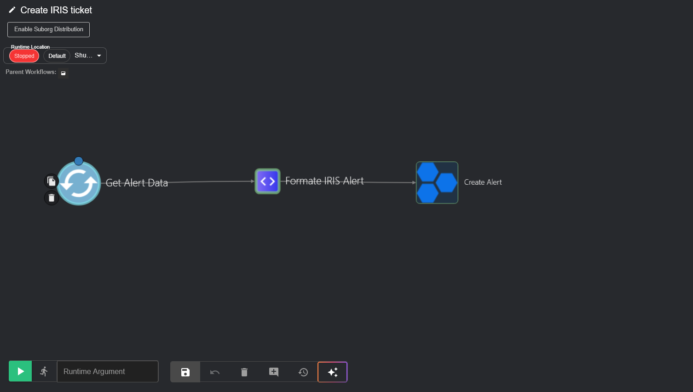
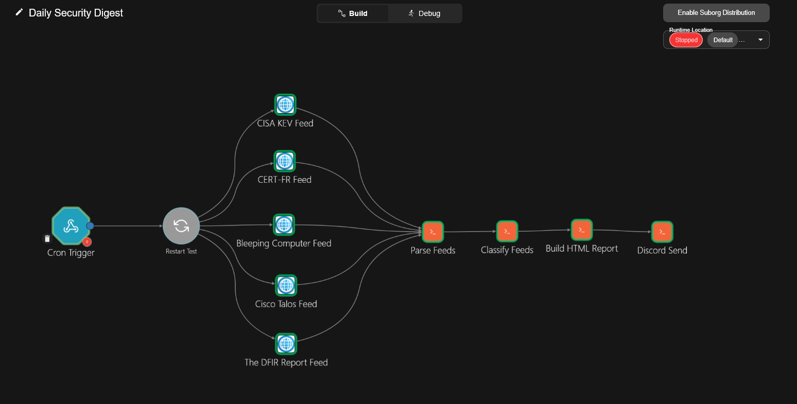

# SOC Automation — Shuffle SOAR Workflows

End-to-end Security Operations Center automation built with an open-source
stack. This repository contains production-grade Shuffle SOAR workflows
automating the full alert lifecycle: from SIEM ingestion to threat
intelligence enrichment to incident ticket creation.

All workflows are exported in anonymized form. No API keys, tokens, or
internal infrastructure details are included.

---

## Stack

| Role | Tool |
|------|------|
| SOAR | [Shuffle](https://shuffler.io/) |
| SIEM / XDR | [Wazuh](https://wazuh.com/) |
| SIRP | [DFIR-IRIS](https://dfir-iris.org/) |
| Threat Intelligence | [OpenCTI](https://www.opencti.io/) + [Cortex](https://thehive-project.org/) |

---

## Architecture Overview

The pipeline follows a modular, event-driven architecture. The orchestrator
receives Wazuh alerts via webhook and delegates processing to specialized
sub-workflows, each handling a single responsibility.

For a detailed technical breakdown, see [architecture.md](architecture.md).

---

## Workflows

### 1. SIEM to Ticket — Orchestrator

**File:** `workflows/SIEM_to_ticket.json`

The central workflow that drives the entire alert processing pipeline. It is
triggered by a Wazuh webhook and coordinates all downstream sub-workflows
through Shuffle's sub-workflow mechanism.

It receives raw Wazuh alert JSON, calls Parse and Normalize to extract IOCs,
dispatches enrichment to both Cortex and OpenCTI in parallel, merges results
from both branches into a unified structure, then passes everything to the
Create IRIS Ticket sub-workflow. Three merge actions (Merge_Alert_Data,
Merge_Observables, Merge_Enrichments) consolidate parallel
branch data before forwarding downstream.

---

### 2. Parse and Normalize Observables

**File:** `workflows/Parse_and_Normalize_Observables.json`

A focused two-step workflow that transforms raw Wazuh alert data into a
structured, standardized format consumable by all downstream workflows.

**Extract_Observables** uses Shuffle's built-in IOC parser to identify and
extract observables from the alert payload: IP addresses, file hashes
(MD5, SHA1, SHA256), URLs, and domain names.

**Normalize_Observables** is a custom Python action that reorganizes the
extracted IOCs into a typed schema, each type containing a list of values.
This normalization is the contract between the ingestion layer and all
enrichment workflows, adding a new observable type only requires updating
this single step.

---

### 3. Cortex Observables Enrichment

**File:** `workflows/Cortex_Observables_Enrichment.json`

The most technically dense workflow in the pipeline with 13 actions, querying
multiple external threat intelligence sources in parallel based on observable
type. Each API call routes to the appropriate analyzer depending on what was
extracted.

- **VirusTotal** — Four separate actions for hashes, IPs, URLs, and domains.
  Returns detection ratios, scan results, and community reputation scores.
- **AbuseIPDB** — IP reputation check. Returns abuse confidence score,
  ISP information, and report history.
- **MalwareBazaar** — Hash lookup against Abuse.ch's malware sample database.
  Returns malware family, tags, and first/last seen dates.
- **URLScan.io** — URL and domain scanning. Submits observables for analysis
  and retrieves verdicts and DOM data.

A **Sleep** action handles API rate limiting between submission and report
retrieval for asynchronous analyzers. **Merge_Job_IDs** consolidates all
parallel API responses. **Normalize_Reports** standardizes the heterogeneous
API responses into a uniform enrichment report format via a custom Python
action.

---

### 4. OpenCTI Observables Enrichment

**File:** `workflows/OpenCTI_Observables_Enrichment.json`

Queries the internal OpenCTI threat intelligence platform to correlate
observables against known indicators of compromise. Unlike the Cortex
workflow which relies on external APIs, this workflow leverages the
organization's own curated threat intelligence, providing attribution,
campaign association, and confidence levels that external sources cannot.

Four GraphQL queries execute in parallel against the OpenCTI API, one per
observable type : **Run_IP_Search**, **Run_Hash_Search**, **Run_URL_Search**,
**Run_Domain_Search**. Each uses OpenCTI's filter system with filterGroups
to perform precise indicator lookups by name. **Merge_Searches** consolidates
all four results, and **Normalize_Searches** extracts relevant indicator
metadata (labels, confidence, marking definitions, creation date) into a
standardized format.

---

### 5. Create IRIS Ticket

**File:** `workflows/Create_IRIS_ticket.json`

The final step in the pipeline. Takes the fully enriched alert and creates
a structured incident alert in DFIR-IRIS for analyst triage.

**Formate_IRIS_Alert** is a custom Python action that maps the enriched
alert into the exact JSON schema expected by the DFIR-IRIS API. This
includes Wazuh alert fields (rule ID, description, agent name and IP,
MITRE ATT&CK references) and enrichment summaries (VirusTotal detection
ratios, AbuseIPDB confidence score, OpenCTI indicator matches).

**Create_Alert** calls the DFIR-IRIS API to create the ticket. By the time
an analyst opens it in IRIS, they already have the original alert, all
extracted observables, and all enrichment context in one place, no manual
lookups required.

---

### 6. Daily Security Digest

**File:** `workflows/Daily_Security_Digest.json`

A standalone, cron-triggered workflow that runs independently from the alert
pipeline. It aggregates daily cybersecurity threat intelligence from multiple
public sources, classifies items by urgency, and delivers a formatted digest
to a Discord channel as an HTML report attachment.

**Data collection — five parallel HTTP feeds:**

- **CISA_KEV_Feed** — CISA's Known Exploited Vulnerabilities catalog (JSON).
  Provides the authoritative list of CVEs actively exploited in the wild, with
  remediation due dates.
- **The_DFIR_Report_Feed** — RSS feed from The DFIR Report covering real-world
  intrusion analyses and threat actor TTPs.
- **Cisco_Talos_Feed** — RSS feed from Cisco Talos Intelligence with threat
  research and vulnerability disclosures.
- **CERT-FR_Feed** — RSS feed from the French national CERT covering advisories
  and alerts relevant to French-market infrastructure.
- **Bleeping_Computer_Feed** — RSS feed from Bleeping Computer for broader
  cybersecurity news and ransomware tracking.

**Parse_Feeds** — A custom Python action that normalizes all five feeds into a
unified item schema regardless of source format (JSON KEV or RSS/XML). Handles
RFC 2822 date parsing, HTML stripping, and CVE extraction from free-text
summaries.

**Classify_Feeds** — A custom Python action that scores each item against two
keyword stacks. The `STACK_URGENT` stack covers the organization's technology
perimeter (firewalls, AD, backup software, SOAR stack, active ransomware
groups, exploit primitives). Items matching this stack are flagged as urgent
and rendered with a visual priority indicator. Items referencing a CVE from
the CISA KEV catalog are additionally flagged with the remediation due date.

**Build_HTML_Report** — Generates a self-contained HTML file with dark-mode
styling, a statistics bar (total items, urgent count, CVE count, KEV count),
and a card-based layout sorted by urgency then date. Also produces a compact
Discord embed summary with the key counts.

**Discord_Send** — Posts the digest to a Discord channel via webhook. Sends
both the embed (inline summary) and the full HTML report as a file attachment,
allowing analysts to read the summary directly in Discord or download the
complete report.

This workflow is entirely self-contained and requires no connection to the
alert pipeline. It can be deployed independently alongside or without the
SIEM-to-ticket pipeline.

---

## How to Import

1. Open your Shuffle instance
2. Navigate to **Workflows** then **Import**
3. Upload any `.json` file from the `workflows/` directory
4. Configure your API credentials in each app's authentication settings
5. Update the orchestrator's sub-workflow references to point to your
   imported workflow IDs

All workflows are exported anonymized. You will need to configure your
own API keys, instance URLs, and authentication tokens for each integration.

For the Daily Security Digest specifically:

- Set the `WEBHOOK_URL` constant in the `Discord_Send` action to your Discord
  channel webhook URL.
- The `Cron_Trigger` webhook URL is auto-generated by Shuffle after import.
  Scheduling is done via an OS-level cron job that sends a daily `curl -X POST`
  to that URL — see [architecture.md](architecture.md) for the exact
  crontab entry and verification steps.

---

## Design Decisions

**Modular sub-workflow architecture** — Each workflow handles exactly one
responsibility. Individual components are independently reusable, testable,
and replaceable without affecting the rest of the pipeline.

**Dual enrichment strategy** — Observables are enriched from both external
APIs (Cortex workflow) and an internal TIP (OpenCTI workflow). External
sources provide broad coverage and reputation data. Internal sources provide
organizational context and threat actor attribution.

**Normalization layer** — The Parse and Normalize workflow decouples the
SIEM alert format from downstream processing. Changing the SIEM or adding
a new data source only requires updating the normalization step.

**Parallel execution with merge** — Enrichment workflows run in parallel.
Results are merged before ticket creation to minimize latency while ensuring
the IRIS ticket contains the complete enrichment picture.

---

## License

MIT License — see [LICENSE](LICENSE).